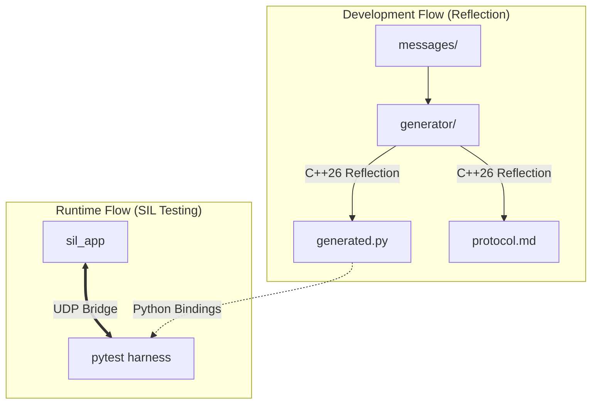
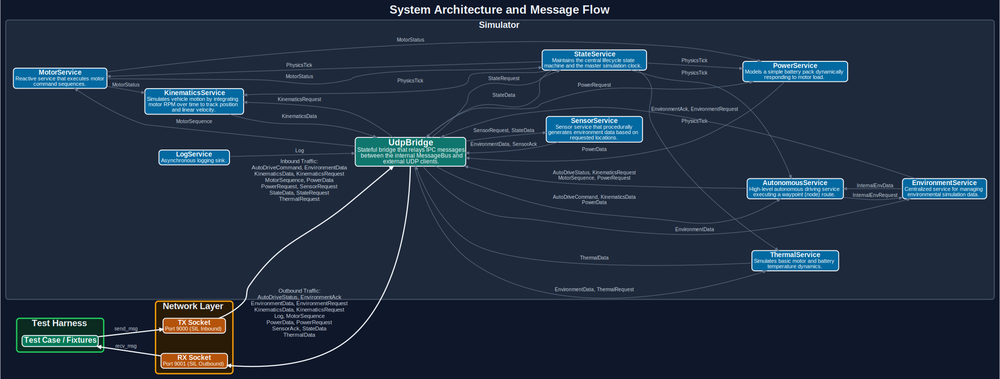

# reflect_pytest

A software-in-the-loop (SIL) test framework that uses **C++26 static reflection** to automatically expose a C++ IPC message bus to **pytest** over UDP — no hand-written glue.

## Architecture


The current POC implements a single-node Publisher/Subscriber bus backed by an AF_UNIX socket, bridged to a UDP port so `pytest` can interact with it.



## Visual Architecture

The following diagram illustrates the complete system architecture and message flow, automatically generated from the C++ source code via reflection.

### 📊 System Message Flow

> [!TIP]
> This diagram is available as a [High-Resolution SVG](doc/ipc/ipc_flow.svg) and a [Universal PNG](ipc_flow.png) in the repository.

## Documentation Index

The following internal documents provide detailed information on the system's design and usage:

### 🏗️ Architecture
- **[Software Design Principles](doc/arch/design.md)**: SOA, IPC, and logging philosophy.
- **[Autonomous Service Spec](doc/arch/autonomous_service.md)**: Waypoint controller and environment adaptation.

### 🔮 Reflection System
- **[Reflection System Architecture](doc/reflection/system.md)**: Deep dive into `std::meta` pipelines and binding generation.
- **[C++26 Reflection Cheat Sheet](doc/reflection/cheat_sheet.md)**: Guide to P2996/P3394 features.

### 🔌 IPC & Protocol
- **[IPC Protocol Reference](doc/ipc/protocol.md)**: **Auto-generated** ground truth for wire formats and flows.

### 🧪 Testing
- **[SIL Testing Guide](doc/testing/sil_guide.md)**: How the Python test harness interacts with the C++ bus.

## How it works

1. All message IDs live in `enum class MsgId : uint16_t`.
2. Each ID is bound to its payload struct via `MessageTraits<MsgId::Foo>`.
3. C++26 reflection walks the enum and every struct at compile time, emitting pybind11 bindings automatically.
4. pytest sends/receives real UDP packets using the generated Python types.

## Build & Test

`pytest` is the single entry point for orchestrating the build, unit tests, and integration tests.

```bash
# 1. Build C++ app, run ctest (GTest), then run pytest SIL suite
pytest tests/python/ --build

# 2. Run the SIL suite only (app must be built)
pytest tests/python/

# 3. Stream sil_app output live to your terminal during tests
pytest tests/python/ -v -s

# 4. Simulator Mode: Run the C++ app for 10 seconds (no Python tests)
pytest tests/python/ --simulator --sim-duration 10
```

## Compiler Setup (C++26 Reflection)

This project relies on **C++26 static reflection** (P2996), which is currently only available on GCC trunk via the `-freflection` flag. 

In this devcontainer, the compiler is provided by the `gcc-snapshot` package from the `ppa:ubuntu-toolchain-r/test` Ubuntu PPA. It installs to `/usr/lib/gcc-snapshot/bin/g++`. Note that despite being trunk, the snapshot sometimes self-reports its version as `12.0.0` depending on the build date, so not all C++23 features (like `<print>`) are necessarily present in the snapshot payload.

## Stack

| Layer | Technology |
|---|---|
| C++ standard | C++26 (`-freflection`, GCC snapshot) |
| Build | CMake + Ninja |
| IPC | AF_UNIX `SOCK_DGRAM` |
| Test transport | UDP (single port 9000) |
| Python bindings | C++26 reflection (auto-generated) |
| C++ unit tests | GoogleTest |
| SIL test runner | pytest + pytest-cov + pytest-xdist |
