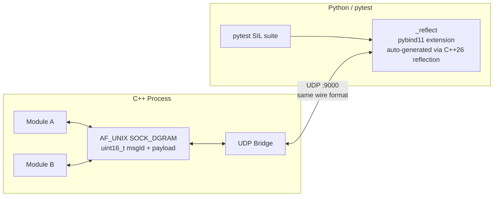

# reflect_pytest

A software-in-the-loop (SIL) test framework that uses **C++26 static reflection** to automatically expose a C++ IPC message bus to **pytest** over UDP — no hand-written glue.

## Architecture



**Wire format** (identical on AF_UNIX and UDP):
```
┌──────────────┬────────────────────────────────┐
│ msgId: u16   │ payload: sizeof(T) bytes        │
└──────────────┴────────────────────────────────┘
```

Payloads are **fixed-size and trivially copyable**. Any packet whose length ≠ `sizeof(T)` is discarded and an error is reported.

## How it works

1. All message IDs live in `enum class MsgId : uint16_t`.
2. Each ID is bound to its payload struct via `MessageTraits<MsgId::Foo>`.
3. C++26 reflection walks the enum and every struct at compile time, emitting pybind11 bindings automatically.
4. pytest sends/receives real UDP packets using the generated Python types.

## Build & Test

```bash
# 1. Configure + build
cmake -B build -G Ninja
cmake --build build

# 2. C++ unit tests
ctest --test-dir build --output-on-failure

# 3. SIL integration suite
pytest tests/python/
```

## Stack

| Layer | Technology |
|---|---|
| C++ standard | C++26 (`-freflection`, GCC snapshot) |
| Build | CMake + Ninja |
| IPC | AF_UNIX `SOCK_DGRAM` |
| Test transport | UDP (single port 9000) |
| Python bindings | pybind11 (auto-generated) |
| C++ unit tests | GoogleTest |
| SIL test runner | pytest + pytest-cov + pytest-xdist |
