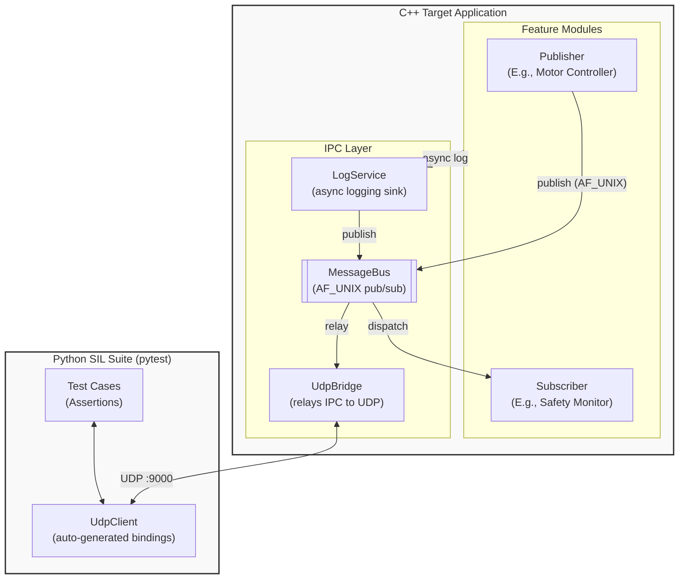

# reflect_pytest

A software-in-the-loop (SIL) test framework that uses **C++26 static reflection** to automatically expose a C++ IPC message bus to **pytest** over UDP — no hand-written glue.

## Architecture

> [!TIP]
> To preview the Mermaid diagrams below directly in VS Code, install the **Markdown Preview Mermaid Support** extension (`bierner.markdown-mermaid`). It has been added to `.devcontainer.json` recommendations.

The current POC implements a single-node Publisher/Subscriber bus backed by an AF_UNIX socket, bridged to a UDP port so `pytest` can interact with it.



For more details on the software architecture and principles, see [Software Design](doc/agent/design.md).

**Wire format** (identical on AF_UNIX and UDP):
```
┌──────────────┬────────────────────────────────┐
│ msgId: u16   │ payload: sizeof(T) bytes        │
└──────────────┴────────────────────────────────┘
```

Payloads are **fixed-size and trivially copyable**. Any packet whose length ≠ `sizeof(T)` is discarded and an error is reported.

## How it works

1. All message IDs live in `enum class MsgId : uint16_t`.
2. Each ID is bound to its payload struct via `MessageTraits<MsgId::Foo>`.
3. C++26 reflection walks the enum and every struct at compile time, emitting pybind11 bindings automatically.
4. pytest sends/receives real UDP packets using the generated Python types.

## Build & Test

`pytest` is the single entry point for orchestrating the build, unit tests, and integration tests.

```bash
# 1. Build C++ app, run ctest (GTest), then run pytest SIL suite
pytest tests/python/ --build -v

# 2. Run the SIL suite only (app must be built)
pytest tests/python/ -v

# 3. Stream sil_app output live to your terminal during tests
pytest tests/python/ -v -s

# 4. Simulator Mode: Run the C++ app for 10 seconds (no Python tests)
pytest tests/python/ --simulator --sim-duration 10
```

## Compiler Setup (C++26 Reflection)

This project relies on **C++26 static reflection** (P2996), which is currently only available on GCC trunk via the `-freflection` flag. 

In this devcontainer, the compiler is provided by the `gcc-snapshot` package from the `ppa:ubuntu-toolchain-r/test` Ubuntu PPA. It installs to `/usr/lib/gcc-snapshot/bin/g++`. Note that despite being trunk, the snapshot sometimes self-reports its version as `12.0.0` depending on the build date, so not all C++23 features (like `<print>`) are necessarily present in the snapshot payload.

## Stack

| Layer | Technology |
|---|---|
| C++ standard | C++26 (`-freflection`, GCC snapshot) |
| Build | CMake + Ninja |
| IPC | AF_UNIX `SOCK_DGRAM` |
| Test transport | UDP (single port 9000) |
| Python bindings | C++26 reflection (auto-generated) |
| C++ unit tests | GoogleTest |
| SIL test runner | pytest + pytest-cov + pytest-xdist |
