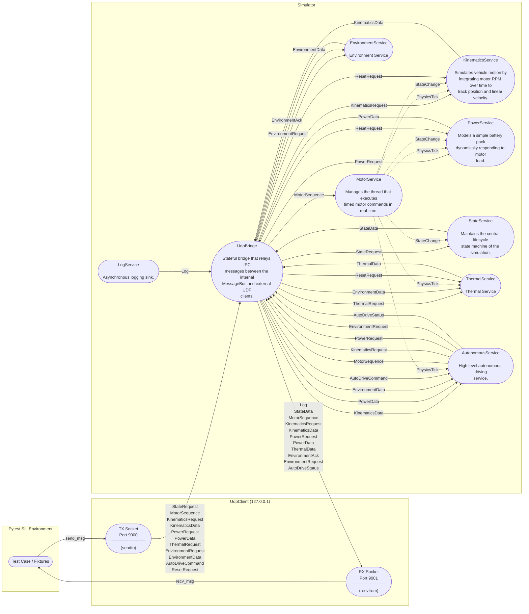

# IPC Protocol Reference

> **Auto-generated** by `generate_docs` using C++26 static reflection (P2996 + P3394).
> Do not edit by hand — re-run `cmake --build build --target generate_docs` to refresh.

This document describes the full wire protocol used between the Python test harness
and the C++ SIL (Software-in-the-Loop) application.

## System Architecture

```
┌─────────────────────┐          UDP (port 9000)         ┌─────────────────────┐
│   Python / pytest   │ ──────────────────────────────── │     sil_app (C++)   │
│                     │   [uint16_t msgId][payload bytes] │                     │
│  udp_client.py      │                                   │  UdpBridge          │
│  generated.py       │                                   │  ├─ MessageBus      │
└─────────────────────┘                                   │  ├─ Simulator       │
                                                          │  └─ Logger          │
                                                          └─────────────────────┘
```

**Wire format:** Every datagram starts with a `uint16_t` message ID (host-byte
order) followed immediately by the fixed-size payload struct (packed, no padding).
If `sizeof(received payload) != sizeof(Payload)` the message is silently discarded.

**Threads (C++ side):**

| Thread | Purpose |
|---|---|
| `main` | Waits on shutdown signal; futex sleep |
| `heartbeat` | Publishes `LogPayload` "Hello World #N" every 500 ms |
| `bus-listener` | AF\_UNIX recv loop → dispatch to subscribers |
| `sim-exec` | Steps through `MotorSequencePayload` in real time |
| `sim-log` | Publishes kinematics status log every 1 000 ms |
| `bridge-rx` | UDP recv → injects into MessageBus |

---

## Message Flow

This diagram gives three distinct columns: `Pytest` uses the `UdpClient` module to orchestrate test cases, `Network` maps the transport layer across two explicit sockets (`Client -> App` and `App -> Client`), and `Simulator` processes the messages internally.



---

## Component Services

The application is composed of the following services:

### `MotorService`

> Manages the thread that executes timed motor commands in real-time.

This service is responsible for stepping through a sequence of motor commands, emitting standard `PhysicsTick` events at 100Hz, and broadcasting `StateChange` events when a sequence starts or finishes.

### `KinematicsService`

> Simulates vehicle motion by integrating motor RPM over time to track position and linear velocity.

The physics model applies a linear conversion from RPM to meters-per-second, and integrates this velocity over the `PhysicsTick` delta-time to continuously evaluate the vehicle's position:

$$ v = \text{RPM} \times 0.01 \text{ (m/s)} $$

$$ x = \int v \, dt $$

### `PowerService`

> Models a simple battery pack dynamically responding to motor load.

The simulation calculates the current drawn by the motor based on its speed, then applies Ohm's law over the internal resistance to calculate the instantaneous voltage drop. The state of charge (SOC) is linearly interpolated between the maximum and minimum voltage limits:

$$ I = |\text{RPM}| \times 0.005 \text{ (A)} $$

$$ V \mathrel{-}= I \times R_{int} \times dt $$

$$ SOC = \frac{V - V_{min}}{V_{max} - V_{min}} \times 100 $$

### `StateService`

> Maintains the central lifecycle state machine of the simulation.

This component passively tracks the top-level simulated system state (Init, Ready, Executing, Fault) by listening to internal state transitions and makes it available to external clients via ping requests.

### `ThermalService`

> Thermal Service

### `EnvironmentService`

> Environment Service

### `AutonomousService`

> High level autonomous driving service.

### `LogService`

> Asynchronous logging sink.

Collects LogPayloads into a queue and processes them on a background thread to avoid blocking simulation services.

### `UdpBridge`

> Stateful bridge that relays IPC messages between the internal MessageBus and external UDP clients.

It remembers the IP address and port of the last connected test harness and bidirectionally routes all subscribed C++ events out through the UDP socket while safely injecting incoming UDP datagrams onto the internal MessageBus.

---

## Message Payloads

- [`Log`](#msgidlog-logpayload)
- [`StateRequest`](#msgidstaterequest-staterequestpayload)
- [`StateData`](#msgidstatedata-statepayload)
- [`MotorSequence`](#msgidmotorsequence-motorsequencepayloadtemplate<5>)
- [`KinematicsRequest`](#msgidkinematicsrequest-kinematicsrequestpayload)
- [`KinematicsData`](#msgidkinematicsdata-kinematicspayload)
- [`PowerRequest`](#msgidpowerrequest-powerrequestpayload)
- [`PowerData`](#msgidpowerdata-powerpayload)
- [`ThermalRequest`](#msgidthermalrequest-thermalrequestpayload)
- [`ThermalData`](#msgidthermaldata-thermalpayload)
- [`EnvironmentAck`](#msgidenvironmentack-environmentackpayload)
- [`EnvironmentRequest`](#msgidenvironmentrequest-environmentrequestpayload)
- [`EnvironmentData`](#msgidenvironmentdata-environmentpayload)
- [`AutoDriveCommand`](#msgidautodrivecommand-autodrivecommandtemplate<8>)
- [`AutoDriveStatus`](#msgidautodrivestatus-autodrivestatustemplate<8, 4>)
- [`PhysicsTick`](#msgidphysicstick-physicstickpayload)
- [`StateChange`](#msgidstatechange-statechangepayload)
- [`ResetRequest`](#msgidresetrequest-resetrequestpayload)

Each section corresponds to one `MsgId` enumerator. The **direction badge** shows which side initiates the message.

### `MsgId::Log` (`LogPayload`)

> Unidirectional log/trace message. Emitted by any component at any time; Python receives these passively from the bus.

**Direction:** `Outbound`<br>
**Publishes:** `LogService`<br>
**Wire size:** 288 bytes

<table>
  <thead>
    <tr><th>Field</th><th>C++ Type</th><th>Py Type</th><th>Bytes</th><th>Offset</th></tr>
  </thead>
  <tbody>
    <tr>
      <td>text</td>
      <td>char[255]</td>
      <td>bytes</td>
      <td>255</td>
      <td>0</td>
    </tr>
    <tr>
      <td>severity</td>
      <td>Severity</td>
      <td>Severity</td>
      <td>1</td>
      <td>255</td>
    </tr>
    <tr>
      <td>component</td>
      <td>char[32]</td>
      <td>bytes</td>
      <td>32</td>
      <td>256</td>
    </tr>
  </tbody>
</table>

### `MsgId::StateRequest` (`StateRequestPayload`)

> One-byte sentinel. Send to request a StateData snapshot. The payload value is ignored.

**Direction:** `Inbound`<br>
**Subscribes:** `StateService`<br>
**Wire size:** 1 bytes

<table>
  <thead>
    <tr><th>Field</th><th>C++ Type</th><th>Py Type</th><th>Bytes</th><th>Offset</th></tr>
  </thead>
  <tbody>
    <tr>
      <td>reserved</td>
      <td>uint8_t</td>
      <td>int</td>
      <td>1</td>
      <td>0</td>
    </tr>
  </tbody>
</table>

### `MsgId::StateData` (`StatePayload`)

> State machine snapshot sent in response to a StateRequest. Carries the current coarse lifecycle SystemState.

**Direction:** `Outbound`<br>
**Publishes:** `StateService`<br>
**Wire size:** 1 bytes

<table>
  <thead>
    <tr><th>Field</th><th>C++ Type</th><th>Py Type</th><th>Bytes</th><th>Offset</th></tr>
  </thead>
  <tbody>
    <tr>
      <td>state</td>
      <td>SystemState</td>
      <td>SystemState</td>
      <td>1</td>
      <td>0</td>
    </tr>
  </tbody>
</table>

### `MsgId::MotorSequence` (`MotorSequencePayloadTemplate<5>`)

> Deliver a sequence of up to 10 timed motor sub-commands to the simulator. The simulator executes steps[0..num_steps-1] in real time; a new command preempts any currently running sequence.

**Direction:** `Bidirectional`<br>
**Publishes:** `AutonomousService`<br>
**Subscribes:** `MotorService`<br>
**Wire size:** 35 bytes

<table>
  <thead>
    <tr><th>Field</th><th>C++ Type</th><th>Py Type</th><th>Bytes</th><th>Offset</th></tr>
  </thead>
  <tbody>
    <tr>
      <td>cmd_id</td>
      <td>uint32_t</td>
      <td>int</td>
      <td>4</td>
      <td>0</td>
    </tr>
    <tr>
      <td>num_steps</td>
      <td>uint8_t</td>
      <td>int</td>
      <td>1</td>
      <td>4</td>
    </tr>
    <tr>
      <td>steps</td>
      <td>std::array<MotorSubCmd, 5></td>
      <td>Any</td>
      <td>30</td>
      <td>5</td>
    </tr>
  </tbody>
</table>

#### Sub-struct: `std::array<MotorSubCmd, 5>`

**Wire size:** 30 bytes

<table>
  <thead>
    <tr><th>Field</th><th>C++ Type</th><th>Py Type</th><th>Bytes</th><th>Offset</th></tr>
  </thead>
  <tbody>
    <tr>
      <td>_M_elems</td>
      <td>MotorSubCmd[5]</td>
      <td>bytes</td>
      <td>30</td>
      <td>0</td>
    </tr>
  </tbody>
</table>

#### Sub-struct: `MotorSubCmd`

> One timed motor command step, embedded in MotorSequencePayload.

**Wire size:** 6 bytes

<table>
  <thead>
    <tr><th>Field</th><th>C++ Type</th><th>Py Type</th><th>Bytes</th><th>Offset</th></tr>
  </thead>
  <tbody>
    <tr>
      <td>speed_rpm</td>
      <td>int16_t</td>
      <td>int</td>
      <td>2</td>
      <td>0</td>
    </tr>
    <tr>
      <td>duration_us</td>
      <td>uint32_t</td>
      <td>int</td>
      <td>4</td>
      <td>2</td>
    </tr>
  </tbody>
</table>

### `MsgId::KinematicsRequest` (`KinematicsRequestPayload`)

> One-byte sentinel. Send to request a KinematicsData snapshot. The payload value is ignored.

**Direction:** `Bidirectional`<br>
**Publishes:** `AutonomousService`<br>
**Subscribes:** `KinematicsService`<br>
**Wire size:** 1 bytes

<table>
  <thead>
    <tr><th>Field</th><th>C++ Type</th><th>Py Type</th><th>Bytes</th><th>Offset</th></tr>
  </thead>
  <tbody>
    <tr>
      <td>reserved</td>
      <td>uint8_t</td>
      <td>int</td>
      <td>1</td>
      <td>0</td>
    </tr>
  </tbody>
</table>

### `MsgId::KinematicsData` (`KinematicsPayload`)

> Kinematics snapshot sent in response to a KinematicsRequest. Reflects physics state integrated since the start of the current sequence.

**Direction:** `Bidirectional`<br>
**Publishes:** `KinematicsService`<br>
**Subscribes:** `AutonomousService`<br>
**Wire size:** 16 bytes

<table>
  <thead>
    <tr><th>Field</th><th>C++ Type</th><th>Py Type</th><th>Bytes</th><th>Offset</th></tr>
  </thead>
  <tbody>
    <tr>
      <td>cmd_id</td>
      <td>uint32_t</td>
      <td>int</td>
      <td>4</td>
      <td>0</td>
    </tr>
    <tr>
      <td>elapsed_us</td>
      <td>uint32_t</td>
      <td>int</td>
      <td>4</td>
      <td>4</td>
    </tr>
    <tr>
      <td>position_m</td>
      <td>float</td>
      <td>float</td>
      <td>4</td>
      <td>8</td>
    </tr>
    <tr>
      <td>speed_mps</td>
      <td>float</td>
      <td>float</td>
      <td>4</td>
      <td>12</td>
    </tr>
  </tbody>
</table>

### `MsgId::PowerRequest` (`PowerRequestPayload`)

> One-byte sentinel. Send to request a PowerData snapshot. The payload value is ignored.

**Direction:** `Bidirectional`<br>
**Publishes:** `AutonomousService`<br>
**Subscribes:** `PowerService`<br>
**Wire size:** 1 bytes

<table>
  <thead>
    <tr><th>Field</th><th>C++ Type</th><th>Py Type</th><th>Bytes</th><th>Offset</th></tr>
  </thead>
  <tbody>
    <tr>
      <td>reserved</td>
      <td>uint8_t</td>
      <td>int</td>
      <td>1</td>
      <td>0</td>
    </tr>
  </tbody>
</table>

### `MsgId::PowerData` (`PowerPayload`)

> Power-model snapshot sent in response to a PowerRequest. Models a simple battery with internal resistance drain.

**Direction:** `Bidirectional`<br>
**Publishes:** `PowerService`<br>
**Subscribes:** `AutonomousService`<br>
**Wire size:** 13 bytes

<table>
  <thead>
    <tr><th>Field</th><th>C++ Type</th><th>Py Type</th><th>Bytes</th><th>Offset</th></tr>
  </thead>
  <tbody>
    <tr>
      <td>cmd_id</td>
      <td>uint32_t</td>
      <td>int</td>
      <td>4</td>
      <td>0</td>
    </tr>
    <tr>
      <td>voltage_v</td>
      <td>float</td>
      <td>float</td>
      <td>4</td>
      <td>4</td>
    </tr>
    <tr>
      <td>current_a</td>
      <td>float</td>
      <td>float</td>
      <td>4</td>
      <td>8</td>
    </tr>
    <tr>
      <td>state_of_charge</td>
      <td>uint8_t</td>
      <td>int</td>
      <td>1</td>
      <td>12</td>
    </tr>
  </tbody>
</table>

### `MsgId::ThermalRequest` (`ThermalRequestPayload`)

> One-byte sentinel. Send to request a ThermalData snapshot. The payload value is ignored.

**Direction:** `Inbound`<br>
**Subscribes:** `ThermalService`<br>
**Wire size:** 1 bytes

<table>
  <thead>
    <tr><th>Field</th><th>C++ Type</th><th>Py Type</th><th>Bytes</th><th>Offset</th></tr>
  </thead>
  <tbody>
    <tr>
      <td>reserved</td>
      <td>uint8_t</td>
      <td>int</td>
      <td>1</td>
      <td>0</td>
    </tr>
  </tbody>
</table>

### `MsgId::ThermalData` (`ThermalPayload`)

> Thermal snapshot sent in response to a ThermalRequest. Models temperature of motor and battery based on power metrics.

**Direction:** `Outbound`<br>
**Publishes:** `ThermalService`<br>
**Wire size:** 8 bytes

<table>
  <thead>
    <tr><th>Field</th><th>C++ Type</th><th>Py Type</th><th>Bytes</th><th>Offset</th></tr>
  </thead>
  <tbody>
    <tr>
      <td>motor_temp_c</td>
      <td>float</td>
      <td>float</td>
      <td>4</td>
      <td>0</td>
    </tr>
    <tr>
      <td>battery_temp_c</td>
      <td>float</td>
      <td>float</td>
      <td>4</td>
      <td>4</td>
    </tr>
  </tbody>
</table>

### `MsgId::EnvironmentAck` (`EnvironmentAckPayload`)

> ACK sent by the application when it accepts new environment data.

**Direction:** `Outbound`<br>
**Publishes:** `EnvironmentService`<br>
**Wire size:** 4 bytes

<table>
  <thead>
    <tr><th>Field</th><th>C++ Type</th><th>Py Type</th><th>Bytes</th><th>Offset</th></tr>
  </thead>
  <tbody>
    <tr>
      <td>region_id</td>
      <td>uint32_t</td>
      <td>int</td>
      <td>4</td>
      <td>0</td>
    </tr>
  </tbody>
</table>

### `MsgId::EnvironmentRequest` (`EnvironmentRequestPayload`)

> Request conditions for a specific location.

**Direction:** `Bidirectional`<br>
**Publishes:** `AutonomousService`<br>
**Subscribes:** `EnvironmentService`<br>
**Wire size:** 8 bytes

<table>
  <thead>
    <tr><th>Field</th><th>C++ Type</th><th>Py Type</th><th>Bytes</th><th>Offset</th></tr>
  </thead>
  <tbody>
    <tr>
      <td>target_location</td>
      <td>Point2D</td>
      <td>Any</td>
      <td>8</td>
      <td>0</td>
    </tr>
  </tbody>
</table>

#### Sub-struct: `Point2D`

> A 2D coordinate.

**Wire size:** 8 bytes

<table>
  <thead>
    <tr><th>Field</th><th>C++ Type</th><th>Py Type</th><th>Bytes</th><th>Offset</th></tr>
  </thead>
  <tbody>
    <tr>
      <td>x</td>
      <td>float</td>
      <td>float</td>
      <td>4</td>
      <td>0</td>
    </tr>
    <tr>
      <td>y</td>
      <td>float</td>
      <td>float</td>
      <td>4</td>
      <td>4</td>
    </tr>
  </tbody>
</table>

### `MsgId::EnvironmentData` (`EnvironmentPayload`)

> Environmental conditions delivered to the application from the outside world.

**Direction:** `Inbound`<br>
**Subscribes:** `ThermalService`, `EnvironmentService`, `AutonomousService`<br>
**Wire size:** 32 bytes

<table>
  <thead>
    <tr><th>Field</th><th>C++ Type</th><th>Py Type</th><th>Bytes</th><th>Offset</th></tr>
  </thead>
  <tbody>
    <tr>
      <td>region_id</td>
      <td>uint32_t</td>
      <td>int</td>
      <td>4</td>
      <td>0</td>
    </tr>
    <tr>
      <td>bounds</td>
      <td>BoundingBox2D</td>
      <td>Any</td>
      <td>16</td>
      <td>4</td>
    </tr>
    <tr>
      <td>ambient_temp_c</td>
      <td>float</td>
      <td>float</td>
      <td>4</td>
      <td>20</td>
    </tr>
    <tr>
      <td>incline_percent</td>
      <td>float</td>
      <td>float</td>
      <td>4</td>
      <td>24</td>
    </tr>
    <tr>
      <td>surface_friction</td>
      <td>float</td>
      <td>float</td>
      <td>4</td>
      <td>28</td>
    </tr>
  </tbody>
</table>

#### Sub-struct: `BoundingBox2D`

> An axis-aligned 2D bounding box.

**Wire size:** 16 bytes

<table>
  <thead>
    <tr><th>Field</th><th>C++ Type</th><th>Py Type</th><th>Bytes</th><th>Offset</th></tr>
  </thead>
  <tbody>
    <tr>
      <td>min_pt</td>
      <td>Point2D</td>
      <td>Any</td>
      <td>8</td>
      <td>0</td>
    </tr>
    <tr>
      <td>max_pt</td>
      <td>Point2D</td>
      <td>Any</td>
      <td>8</td>
      <td>8</td>
    </tr>
  </tbody>
</table>

#### Sub-struct: `Point2D`

> A 2D coordinate.

**Wire size:** 8 bytes

<table>
  <thead>
    <tr><th>Field</th><th>C++ Type</th><th>Py Type</th><th>Bytes</th><th>Offset</th></tr>
  </thead>
  <tbody>
    <tr>
      <td>x</td>
      <td>float</td>
      <td>float</td>
      <td>4</td>
      <td>0</td>
    </tr>
    <tr>
      <td>y</td>
      <td>float</td>
      <td>float</td>
      <td>4</td>
      <td>4</td>
    </tr>
  </tbody>
</table>

### `MsgId::AutoDriveCommand` (`AutoDriveCommandTemplate<8>`)

> High level autonomous driving route and configuration.

**Direction:** `Inbound`<br>
**Subscribes:** `AutonomousService`<br>
**Wire size:** 171 bytes

<table>
  <thead>
    <tr><th>Field</th><th>C++ Type</th><th>Py Type</th><th>Bytes</th><th>Offset</th></tr>
  </thead>
  <tbody>
    <tr>
      <td>route_name</td>
      <td>char[32]</td>
      <td>bytes</td>
      <td>32</td>
      <td>0</td>
    </tr>
    <tr>
      <td>mode</td>
      <td>DriveMode</td>
      <td>DriveMode</td>
      <td>1</td>
      <td>32</td>
    </tr>
    <tr>
      <td>p_gain</td>
      <td>float</td>
      <td>float</td>
      <td>4</td>
      <td>33</td>
    </tr>
    <tr>
      <td>use_environment_tuning</td>
      <td>bool</td>
      <td>bool</td>
      <td>1</td>
      <td>37</td>
    </tr>
    <tr>
      <td>route_transform</td>
      <td>std::array<Vector3, 3></td>
      <td>Any</td>
      <td>36</td>
      <td>38</td>
    </tr>
    <tr>
      <td>num_nodes</td>
      <td>uint8_t</td>
      <td>int</td>
      <td>1</td>
      <td>74</td>
    </tr>
    <tr>
      <td>route</td>
      <td>std::array<ManeuverNode, 8></td>
      <td>Any</td>
      <td>96</td>
      <td>75</td>
    </tr>
  </tbody>
</table>

#### Sub-struct: `std::array<Vector3, 3>`

**Wire size:** 36 bytes

<table>
  <thead>
    <tr><th>Field</th><th>C++ Type</th><th>Py Type</th><th>Bytes</th><th>Offset</th></tr>
  </thead>
  <tbody>
    <tr>
      <td>_M_elems</td>
      <td>Vector3[3]</td>
      <td>bytes</td>
      <td>36</td>
      <td>0</td>
    </tr>
  </tbody>
</table>

#### Sub-struct: `Vector3`

> A 3D coordinate vector.

**Wire size:** 12 bytes

<table>
  <thead>
    <tr><th>Field</th><th>C++ Type</th><th>Py Type</th><th>Bytes</th><th>Offset</th></tr>
  </thead>
  <tbody>
    <tr>
      <td>x</td>
      <td>float</td>
      <td>float</td>
      <td>4</td>
      <td>0</td>
    </tr>
    <tr>
      <td>y</td>
      <td>float</td>
      <td>float</td>
      <td>4</td>
      <td>4</td>
    </tr>
    <tr>
      <td>z</td>
      <td>float</td>
      <td>float</td>
      <td>4</td>
      <td>8</td>
    </tr>
  </tbody>
</table>

#### Sub-struct: `std::array<ManeuverNode, 8>`

**Wire size:** 96 bytes

<table>
  <thead>
    <tr><th>Field</th><th>C++ Type</th><th>Py Type</th><th>Bytes</th><th>Offset</th></tr>
  </thead>
  <tbody>
    <tr>
      <td>_M_elems</td>
      <td>ManeuverNode[8]</td>
      <td>bytes</td>
      <td>96</td>
      <td>0</td>
    </tr>
  </tbody>
</table>

#### Sub-struct: `ManeuverNode`

> A single target maneuver point.

**Wire size:** 12 bytes

<table>
  <thead>
    <tr><th>Field</th><th>C++ Type</th><th>Py Type</th><th>Bytes</th><th>Offset</th></tr>
  </thead>
  <tbody>
    <tr>
      <td>target_pos</td>
      <td>Point2D</td>
      <td>Any</td>
      <td>8</td>
      <td>0</td>
    </tr>
    <tr>
      <td>speed_limit_rpm</td>
      <td>int16_t</td>
      <td>int</td>
      <td>2</td>
      <td>8</td>
    </tr>
    <tr>
      <td>timeout_ms</td>
      <td>uint16_t</td>
      <td>int</td>
      <td>2</td>
      <td>10</td>
    </tr>
  </tbody>
</table>

#### Sub-struct: `Point2D`

> A 2D coordinate.

**Wire size:** 8 bytes

<table>
  <thead>
    <tr><th>Field</th><th>C++ Type</th><th>Py Type</th><th>Bytes</th><th>Offset</th></tr>
  </thead>
  <tbody>
    <tr>
      <td>x</td>
      <td>float</td>
      <td>float</td>
      <td>4</td>
      <td>0</td>
    </tr>
    <tr>
      <td>y</td>
      <td>float</td>
      <td>float</td>
      <td>4</td>
      <td>4</td>
    </tr>
  </tbody>
</table>

### `MsgId::AutoDriveStatus` (`AutoDriveStatusTemplate<8, 4>`)

> Status and efficiency report from the AutonomousService.

**Direction:** `Outbound`<br>
**Publishes:** `AutonomousService`<br>
**Wire size:** 152 bytes

<table>
  <thead>
    <tr><th>Field</th><th>C++ Type</th><th>Py Type</th><th>Bytes</th><th>Offset</th></tr>
  </thead>
  <tbody>
    <tr>
      <td>cmd_id</td>
      <td>uint32_t</td>
      <td>int</td>
      <td>4</td>
      <td>0</td>
    </tr>
    <tr>
      <td>current_node_idx</td>
      <td>uint8_t</td>
      <td>int</td>
      <td>1</td>
      <td>4</td>
    </tr>
    <tr>
      <td>route_complete</td>
      <td>bool</td>
      <td>bool</td>
      <td>1</td>
      <td>5</td>
    </tr>
    <tr>
      <td>num_stats</td>
      <td>uint8_t</td>
      <td>int</td>
      <td>1</td>
      <td>6</td>
    </tr>
    <tr>
      <td>node_stats</td>
      <td>std::array<ManeuverStats, 8></td>
      <td>Any</td>
      <td>128</td>
      <td>7</td>
    </tr>
    <tr>
      <td>num_environments_used</td>
      <td>uint8_t</td>
      <td>int</td>
      <td>1</td>
      <td>135</td>
    </tr>
    <tr>
      <td>environment_ids</td>
      <td>std::array<EnvId, 4></td>
      <td>Any</td>
      <td>16</td>
      <td>136</td>
    </tr>
  </tbody>
</table>

#### Sub-struct: `std::array<ManeuverStats, 8>`

**Wire size:** 128 bytes

<table>
  <thead>
    <tr><th>Field</th><th>C++ Type</th><th>Py Type</th><th>Bytes</th><th>Offset</th></tr>
  </thead>
  <tbody>
    <tr>
      <td>_M_elems</td>
      <td>ManeuverStats[8]</td>
      <td>bytes</td>
      <td>128</td>
      <td>0</td>
    </tr>
  </tbody>
</table>

#### Sub-struct: `ManeuverStats`

> Efficiency metrics for a single traveled node.

**Wire size:** 16 bytes

<table>
  <thead>
    <tr><th>Field</th><th>C++ Type</th><th>Py Type</th><th>Bytes</th><th>Offset</th></tr>
  </thead>
  <tbody>
    <tr>
      <td>initial_energy_mj</td>
      <td>float</td>
      <td>float</td>
      <td>4</td>
      <td>0</td>
    </tr>
    <tr>
      <td>final_energy_mj</td>
      <td>float</td>
      <td>float</td>
      <td>4</td>
      <td>4</td>
    </tr>
    <tr>
      <td>energy_per_meter_mj</td>
      <td>float</td>
      <td>float</td>
      <td>4</td>
      <td>8</td>
    </tr>
    <tr>
      <td>total_energy_used_mj</td>
      <td>float</td>
      <td>float</td>
      <td>4</td>
      <td>12</td>
    </tr>
  </tbody>
</table>

#### Sub-struct: `std::array<EnvId, 4>`

**Wire size:** 16 bytes

<table>
  <thead>
    <tr><th>Field</th><th>C++ Type</th><th>Py Type</th><th>Bytes</th><th>Offset</th></tr>
  </thead>
  <tbody>
    <tr>
      <td>_M_elems</td>
      <td>EnvId[4]</td>
      <td>bytes</td>
      <td>16</td>
      <td>0</td>
    </tr>
  </tbody>
</table>

#### Sub-struct: `EnvId`

> Environment ID Wrapper.

**Wire size:** 4 bytes

<table>
  <thead>
    <tr><th>Field</th><th>C++ Type</th><th>Py Type</th><th>Bytes</th><th>Offset</th></tr>
  </thead>
  <tbody>
    <tr>
      <td>id</td>
      <td>uint32_t</td>
      <td>int</td>
      <td>4</td>
      <td>0</td>
    </tr>
  </tbody>
</table>

### `MsgId::PhysicsTick` (`PhysicsTickPayload`)

> Internal IPC: Broadcast at 100Hz during sequence execution to drive kinematics and power integration.

**Direction:** `Internal`<br>
**Publishes:** `MotorService`<br>
**Subscribes:** `KinematicsService`, `PowerService`, `ThermalService`, `AutonomousService`<br>
**Wire size:** 10 bytes

<table>
  <thead>
    <tr><th>Field</th><th>C++ Type</th><th>Py Type</th><th>Bytes</th><th>Offset</th></tr>
  </thead>
  <tbody>
    <tr>
      <td>cmd_id</td>
      <td>uint32_t</td>
      <td>int</td>
      <td>4</td>
      <td>0</td>
    </tr>
    <tr>
      <td>speed_rpm</td>
      <td>int16_t</td>
      <td>int</td>
      <td>2</td>
      <td>4</td>
    </tr>
    <tr>
      <td>dt_us</td>
      <td>uint32_t</td>
      <td>int</td>
      <td>4</td>
      <td>6</td>
    </tr>
  </tbody>
</table>

### `MsgId::StateChange` (`StateChangePayload`)

> Internal IPC: Broadcast when moving into or out of Executing state.

**Direction:** `Internal`<br>
**Publishes:** `MotorService`<br>
**Subscribes:** `KinematicsService`, `PowerService`, `StateService`<br>
**Wire size:** 5 bytes

<table>
  <thead>
    <tr><th>Field</th><th>C++ Type</th><th>Py Type</th><th>Bytes</th><th>Offset</th></tr>
  </thead>
  <tbody>
    <tr>
      <td>state</td>
      <td>SystemState</td>
      <td>SystemState</td>
      <td>1</td>
      <td>0</td>
    </tr>
    <tr>
      <td>cmd_id</td>
      <td>uint32_t</td>
      <td>int</td>
      <td>4</td>
      <td>1</td>
    </tr>
  </tbody>
</table>

### `MsgId::ResetRequest` (`ResetRequestPayload`)

> One-byte sentinel. Send to request a full physics reset.

**Direction:** `Inbound`<br>
**Subscribes:** `KinematicsService`, `PowerService`, `ThermalService`<br>
**Wire size:** 1 bytes

<table>
  <thead>
    <tr><th>Field</th><th>C++ Type</th><th>Py Type</th><th>Bytes</th><th>Offset</th></tr>
  </thead>
  <tbody>
    <tr>
      <td>reserved</td>
      <td>uint8_t</td>
      <td>int</td>
      <td>1</td>
      <td>0</td>
    </tr>
  </tbody>
</table>

---

## Regenerating This File

```bash
# From the repo root:
cmake -B build -G Ninja
cmake --build build --target generate_docs
# Output: build/doc/README.md
```

_Generated with GCC trunk `-std=c++26 -freflection` (P2996R13 + P3394R4)._
