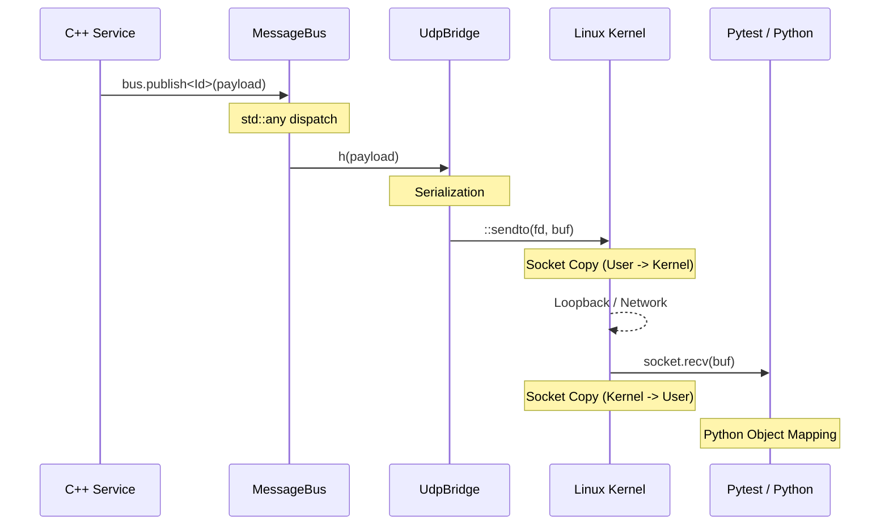

# Message Hub Architecture

The SIL (Software-in-the-Loop) Message Hub is the central nervous system of the simulation. It provides a discovery-less, typed, and lock-free (during runtime) IPC mechanism that connects C++ services to each other and to the Python-based test harness.

## High-Level Flow

The following diagram illustrates the lifecycle of a message as it travels from a C++ publisher to the Python test harness.

## Data Copies Checklist

Efficiency is prioritized for internal C++ communication. However, crossing the boundary to Python via UDP involves several necessary copies.

### Path: C++ Publisher → Python Test Harness

| Step | Location | Data Copy Type | Description |
| :--- | :--- | :--- | :--- |
| **1** | `MessageBus` | **Logical / Refcount** | `std::any` storage. For PODs, it copies the bits. For `shared_ptr` (e.g. `InternalEnvData`), it only increments the refcount. |
| **2** | `UdpBridge` | **Serialization** | The typed payload is packed into a contiguous `uint8_t` buffer along with a 2-byte header (MsgId). |
| **3** | `::sendto` | **Interface Boundary** | The Linux kernel copies the buffer from user-space into a kernel-space Socket Buffer (SKB). |
| **4** | `::recvfrom` | **Interface Boundary** | (Python side) The kernel copies the SKB back into the Python process's user-space memory. |
| **5** | `Python` | **Object Parsing** | The `bytes` object is parsed into Python attributes or mapped via `ctypes.Structure.from_buffer_copy()`. |

### Path: Python → C++ Subscriber

| Step | Location | Data Copy Type | Description |
| :--- | :--- | :--- | :--- |
| **1** | Pytest | **Serialization** | Python serializes the message into a byte-stream. |
| **2** | `::sendto` | **Interface Boundary** | Kernel copy from Python user-space to kernel. |
| **3** | `::recvfrom` | **Interface Boundary** | (UdpBridge) Kernel copy from kernel to C++ user-space `rx_buffer`. |
| **4** | `try_publish_raw` | **Deserialization** | `std::memcpy` from the raw buffer into a stack-allocated typed `Payload` object. |
| **5** | `MessageBus` | **Logical / Refcount**| `std::any` storage copy during the `bus.publish<Id>(p)` call. |

## Optimization Highlights

1. **Lock-Free Dispatch**: Once the system moves past the `Construct -> Start` lifecycle phase, the `MessageBus` handler map is immutable. Lookups are performed without mutexes.
2. **Internal Ref-Counting**: For heavy-duty data like `InternalEnvData` (which contains large arrays or complex structs), we use `std::shared_ptr`. The `MessageBus` simply passes the pointer, ensuring that only the pointer and ref-count are copied within the C++ process.
3. **Contiguous Layout**: Message payloads are designed as standard-layout structs where possible, making the serialization/deserialization step in `UdpBridge` a single `memcpy` operation.

## Network Transport
- **Protocol**: UDP
- **Rationale**: Low latency and no head-of-line blocking. Perfect for 100Hz real-time simulation where a late packet is of less value than the latest packet.
- **Port**: Defaults to `9000`.
