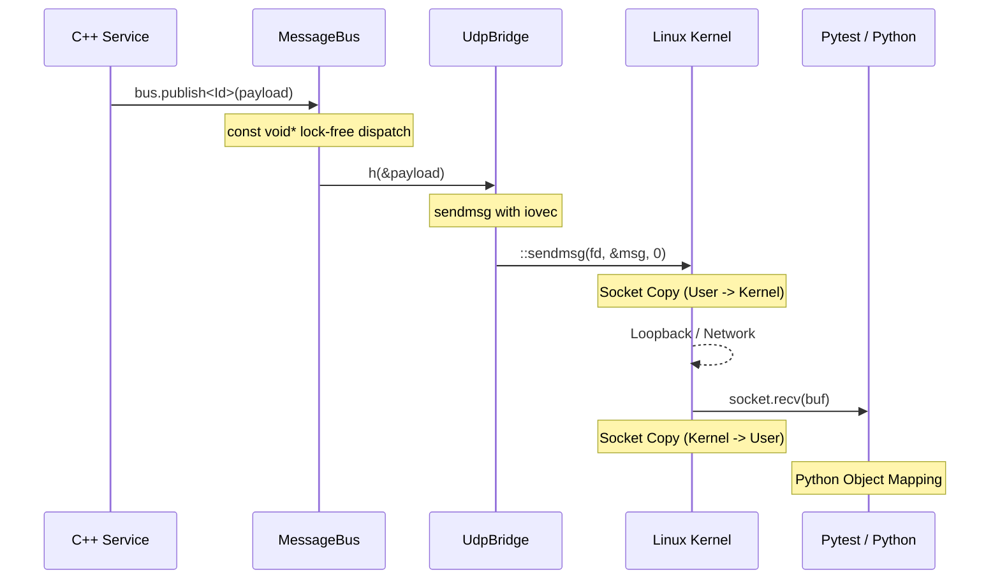

# Message Hub Architecture

The SIL (Software-in-the-Loop) Message Hub is the central nervous system of the simulation. It provides a discovery-less, typed, and lock-free (during runtime) IPC mechanism that connects C++ services to each other and to the Python-based test harness.

## High-Level Flow

The following diagram illustrates the lifecycle of a message as it travels from a C++ publisher to the Python test harness.

## Data Copies Checklist

Efficiency is prioritized for internal C++ communication. However, crossing the boundary to Python via UDP involves necessary copies by the OS network stack. User-space copies have been completely eliminated on the send path.

### Path: C++ Publisher → Python Test Harness

| Step | Location | Data Copy Type | Description |
| :--- | :--- | :--- | :--- |
| **1** | `MessageBus` | **Zero Copy** | Uses `const void*` type erasure. Neither PODs nor smart pointers evaluate any dynamic memory allocation or copying. Only the 8-byte pointer is passed to subscribers. |
| **2** | `UdpBridge` | **Zero Copy** | Uses `sendmsg` and `struct iovec` to transmit the 2-byte header (`MsgId`) and the typed payload in a single syscall without merging them into an intermediate buffer. |
| **3** | `::sendmsg` | **Interface Boundary** | The Linux kernel copies the `iovec` segments from user-space into a kernel-space Socket Buffer (SKB). |
| **4** | `::recvfrom` | **Interface Boundary** | (Python side) The kernel copies the SKB back into the Python process's user-space memory. |
| **5** | `Python` | **Object Parsing** | The `bytes` object is parsed into Python attributes or mapped via `ctypes.Structure.from_buffer_copy()`. |

### Path: Python → C++ Subscriber

| Step | Location | Data Copy Type | Description |
| :--- | :--- | :--- | :--- |
| **1** | Pytest | **Serialization** | Python serializes the message into a byte-stream. |
| **2** | `::sendto` | **Interface Boundary** | Kernel copy from Python user-space to kernel. |
| **3** | `::recvfrom` | **Interface Boundary** | (UdpBridge) Kernel copy from kernel to C++ user-space `rx_buffer`. |
| **4** | `try_publish_raw` | **Deserialization** | `std::memcpy` from the raw buffer into a stack-allocated typed `Payload` object. |
| **5** | `MessageBus` | **Zero Copy** | `const void*` pointer passed to all subscribers. |

## Optimization Highlights

1. **Lock-Free Dispatch**: Once the system moves past the `Construct -> Start` lifecycle phase, the `MessageBus` handler map is immutable. Lookups are performed without mutexes.
2. **Zero-Allocation Type Erasure**: `MessageBus` erases types down to `const void*`. Subscribing lambdas cast back to the explicit `const Payload&`. This completely avoids `std::any` allocations and RTTI overhead.
3. **Zero-Copy UDP Transmission**: `UdpBridge` completely avoids `std::memcpy`. It vectors the `MsgId` header literal and the payload's memory address directly into the kernel's network stack via `sendmsg`.
4. **Lock-Free Atomic Tracking**: UDP connection tracking is lock-free, storing up to 64-bit endpoints inside `std::atomic<uint64_t>` to eliminate atomic data races natively without mutexes.

For an detailed dive into exactly what the compiler does under `-O3 -flto`, see the [Send Path Assembly Analysis](send_path_lto_analysis.md).

## Network Transport
- **Protocol**: UDP
- **Rationale**: Low latency and no head-of-line blocking. Perfect for 100Hz real-time simulation where a late packet is of less value than the latest packet.
- **Port**: Defaults to `9000`.
