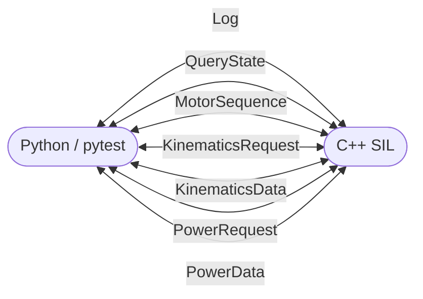

# IPC Protocol Reference

> **Auto-generated** by `generate_docs` using C++26 static reflection (P2996 + P3394).
> Do not edit by hand — re-run `cmake --build build --target generate_docs` to refresh.

This document describes the full wire protocol used between the Python test harness
and the C++ SIL (Software-in-the-Loop) application.

## System Architecture

```
┌─────────────────────┐          UDP (port 9000)         ┌─────────────────────┐
│   Python / pytest   │ ──────────────────────────────── │     sil_app (C++)   │
│                     │   [uint16_t msgId][payload bytes] │                     │
│  udp_client.py      │                                   │  UdpBridge          │
│  generated.py       │                                   │  ├─ MessageBus      │
└─────────────────────┘                                   │  ├─ Simulator       │
                                                          │  └─ Logger          │
                                                          └─────────────────────┘
```

**Wire format:** Every datagram starts with a `uint16_t` message ID (host-byte
order) followed immediately by the fixed-size payload struct (packed, no padding).
If `sizeof(received payload) != sizeof(Payload)` the message is silently discarded.

**Threads (C++ side):**

| Thread | Purpose |
|---|---|
| `main` | Waits on shutdown signal; futex sleep |
| `heartbeat` | Publishes `LogPayload` "Hello World #N" every 500 ms |
| `bus-listener` | AF\_UNIX recv loop → dispatch to subscribers |
| `sim-exec` | Steps through `MotorSequencePayload` in real time |
| `sim-log` | Publishes kinematics status log every 1 000 ms |
| `bridge-rx` | UDP recv → injects into MessageBus |

---

## Message Flow



---

## Component Services

The application is composed of the following services:

---

## Message Payloads

- [`Log`](#msgidlog-logpayload)
- [`QueryState`](#msgidquerystate-querystatepayload)
- [`MotorSequence`](#msgidmotorsequence-motorsequencepayload)
- [`KinematicsRequest`](#msgidkinematicsrequest-kinematicsrequestpayload)
- [`KinematicsData`](#msgidkinematicsdata-kinematicspayload)
- [`PowerRequest`](#msgidpowerrequest-powerrequestpayload)
- [`PowerData`](#msgidpowerdata-powerpayload)
- [`PhysicsTick`](#msgidphysicstick-physicstickpayload)
- [`StateChange`](#msgidstatechange-statechangepayload)

Each section corresponds to one `MsgId` enumerator. The **direction badge** shows which side initiates the message.

### `MsgId::Log` (`LogPayload`)

**Direction:** `Bidirectional`<br>
**Publishes:** `LogService`, `MainPublisher`<br>
**Subscribes:** `UdpBridge`<br>
**Wire size:** 257 bytes

<table>
  <thead>
    <tr><th>Field</th><th>C++ Type</th><th>Py Type</th><th>Bytes</th><th>Offset</th></tr>
  </thead>
  <tbody>
    <tr>
      <td>text</td>
      <td>char[255]</td>
      <td>bytes</td>
      <td>255</td>
      <td>0</td>
    </tr>
    <tr>
      <td>severity</td>
      <td>Severity</td>
      <td>Severity</td>
      <td>1</td>
      <td>255</td>
    </tr>
    <tr>
      <td>component</td>
      <td>ComponentId</td>
      <td>ComponentId</td>
      <td>1</td>
      <td>256</td>
    </tr>
  </tbody>
</table>

### `MsgId::QueryState` (`QueryStatePayload`)

**Direction:** `Bidirectional`<br>
**Publishes:** `StateService`, `UdpBridge`<br>
**Subscribes:** `StateService`, `UdpBridge`<br>
**Wire size:** 1 bytes

<table>
  <thead>
    <tr><th>Field</th><th>C++ Type</th><th>Py Type</th><th>Bytes</th><th>Offset</th></tr>
  </thead>
  <tbody>
    <tr>
      <td>state</td>
      <td>SystemState</td>
      <td>SystemState</td>
      <td>1</td>
      <td>0</td>
    </tr>
  </tbody>
</table>

### `MsgId::MotorSequence` (`MotorSequencePayload`)

**Direction:** `Bidirectional`<br>
**Publishes:** `UdpBridge`<br>
**Subscribes:** `MotorService`<br>
**Wire size:** 65 bytes

<table>
  <thead>
    <tr><th>Field</th><th>C++ Type</th><th>Py Type</th><th>Bytes</th><th>Offset</th></tr>
  </thead>
  <tbody>
    <tr>
      <td>cmd_id</td>
      <td>uint32_t</td>
      <td>int</td>
      <td>4</td>
      <td>0</td>
    </tr>
    <tr>
      <td>num_steps</td>
      <td>uint8_t</td>
      <td>int</td>
      <td>1</td>
      <td>4</td>
    </tr>
    <tr>
      <td>steps</td>
      <td>MotorSubCmd[10]</td>
      <td>bytes</td>
      <td>60</td>
      <td>5</td>
    </tr>
  </tbody>
</table>

#### Sub-struct: `MotorSubCmd`

**Wire size:** 6 bytes

<table>
  <thead>
    <tr><th>Field</th><th>C++ Type</th><th>Py Type</th><th>Bytes</th><th>Offset</th></tr>
  </thead>
  <tbody>
    <tr>
      <td>speed_rpm</td>
      <td>int16_t</td>
      <td>int</td>
      <td>2</td>
      <td>0</td>
    </tr>
    <tr>
      <td>duration_us</td>
      <td>uint32_t</td>
      <td>int</td>
      <td>4</td>
      <td>2</td>
    </tr>
  </tbody>
</table>

### `MsgId::KinematicsRequest` (`KinematicsRequestPayload`)

**Direction:** `Bidirectional`<br>
**Publishes:** `UdpBridge`<br>
**Subscribes:** `KinematicsService`<br>
**Wire size:** 1 bytes

<table>
  <thead>
    <tr><th>Field</th><th>C++ Type</th><th>Py Type</th><th>Bytes</th><th>Offset</th></tr>
  </thead>
  <tbody>
    <tr>
      <td>reserved</td>
      <td>uint8_t</td>
      <td>int</td>
      <td>1</td>
      <td>0</td>
    </tr>
  </tbody>
</table>

### `MsgId::KinematicsData` (`KinematicsPayload`)

**Direction:** `Bidirectional`<br>
**Publishes:** `KinematicsService`<br>
**Subscribes:** `UdpBridge`<br>
**Wire size:** 16 bytes

<table>
  <thead>
    <tr><th>Field</th><th>C++ Type</th><th>Py Type</th><th>Bytes</th><th>Offset</th></tr>
  </thead>
  <tbody>
    <tr>
      <td>cmd_id</td>
      <td>uint32_t</td>
      <td>int</td>
      <td>4</td>
      <td>0</td>
    </tr>
    <tr>
      <td>elapsed_us</td>
      <td>uint32_t</td>
      <td>int</td>
      <td>4</td>
      <td>4</td>
    </tr>
    <tr>
      <td>position_m</td>
      <td>float</td>
      <td>float</td>
      <td>4</td>
      <td>8</td>
    </tr>
    <tr>
      <td>speed_mps</td>
      <td>float</td>
      <td>float</td>
      <td>4</td>
      <td>12</td>
    </tr>
  </tbody>
</table>

### `MsgId::PowerRequest` (`PowerRequestPayload`)

**Direction:** `Bidirectional`<br>
**Publishes:** `UdpBridge`<br>
**Subscribes:** `PowerService`<br>
**Wire size:** 1 bytes

<table>
  <thead>
    <tr><th>Field</th><th>C++ Type</th><th>Py Type</th><th>Bytes</th><th>Offset</th></tr>
  </thead>
  <tbody>
    <tr>
      <td>reserved</td>
      <td>uint8_t</td>
      <td>int</td>
      <td>1</td>
      <td>0</td>
    </tr>
  </tbody>
</table>

### `MsgId::PowerData` (`PowerPayload`)

**Direction:** `Bidirectional`<br>
**Publishes:** `PowerService`<br>
**Subscribes:** `UdpBridge`<br>
**Wire size:** 13 bytes

<table>
  <thead>
    <tr><th>Field</th><th>C++ Type</th><th>Py Type</th><th>Bytes</th><th>Offset</th></tr>
  </thead>
  <tbody>
    <tr>
      <td>cmd_id</td>
      <td>uint32_t</td>
      <td>int</td>
      <td>4</td>
      <td>0</td>
    </tr>
    <tr>
      <td>voltage_v</td>
      <td>float</td>
      <td>float</td>
      <td>4</td>
      <td>4</td>
    </tr>
    <tr>
      <td>current_a</td>
      <td>float</td>
      <td>float</td>
      <td>4</td>
      <td>8</td>
    </tr>
    <tr>
      <td>state_of_charge</td>
      <td>uint8_t</td>
      <td>int</td>
      <td>1</td>
      <td>12</td>
    </tr>
  </tbody>
</table>

### `MsgId::PhysicsTick` (`PhysicsTickPayload`)

**Direction:** `Internal (C++ ↔ C++)`<br>
**Publishes:** `MotorService`<br>
**Subscribes:** `KinematicsService`, `PowerService`, `LogService`<br>
**Wire size:** 10 bytes

<table>
  <thead>
    <tr><th>Field</th><th>C++ Type</th><th>Py Type</th><th>Bytes</th><th>Offset</th></tr>
  </thead>
  <tbody>
    <tr>
      <td>cmd_id</td>
      <td>uint32_t</td>
      <td>int</td>
      <td>4</td>
      <td>0</td>
    </tr>
    <tr>
      <td>speed_rpm</td>
      <td>int16_t</td>
      <td>int</td>
      <td>2</td>
      <td>4</td>
    </tr>
    <tr>
      <td>dt_us</td>
      <td>uint32_t</td>
      <td>int</td>
      <td>4</td>
      <td>6</td>
    </tr>
  </tbody>
</table>

### `MsgId::StateChange` (`StateChangePayload`)

**Direction:** `Internal (C++ ↔ C++)`<br>
**Publishes:** `MotorService`<br>
**Subscribes:** `KinematicsService`, `PowerService`, `StateService`, `LogService`<br>
**Wire size:** 5 bytes

<table>
  <thead>
    <tr><th>Field</th><th>C++ Type</th><th>Py Type</th><th>Bytes</th><th>Offset</th></tr>
  </thead>
  <tbody>
    <tr>
      <td>state</td>
      <td>SystemState</td>
      <td>SystemState</td>
      <td>1</td>
      <td>0</td>
    </tr>
    <tr>
      <td>cmd_id</td>
      <td>uint32_t</td>
      <td>int</td>
      <td>4</td>
      <td>1</td>
    </tr>
  </tbody>
</table>

---

## Regenerating This File

```bash
# From the repo root:
cmake -B build -G Ninja
cmake --build build --target generate_docs
# Output: build/doc/ipc_protocol.md
```

_Generated with GCC trunk `-std=c++26 -freflection` (P2996R13 + P3394R4)._
