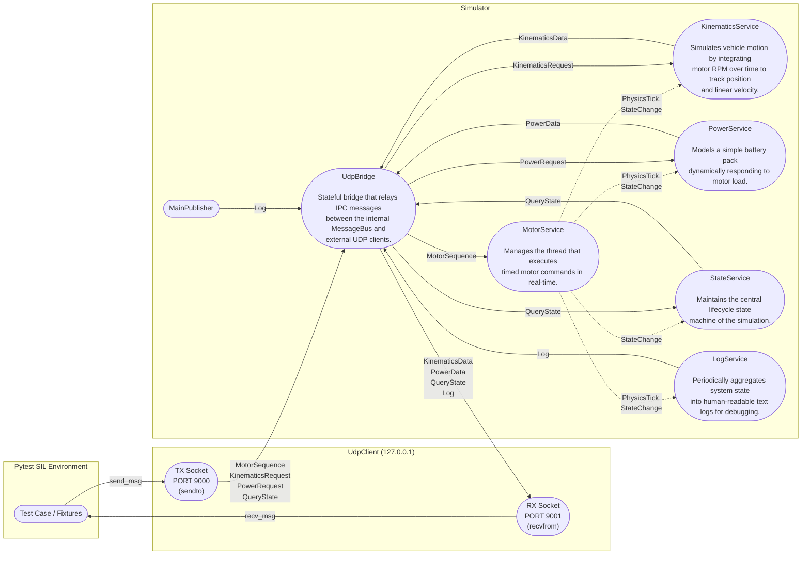

# Mermaid Prototypes

## Option 6: Independent Network Routing Subgraph

Based on your feedback, we'll extract the UDP Client and socket routing out of the Pytest logical grouping, and put it into an independent third Subgraph serving as the Linux local interface `127.0.0.1`.

This diagram gives three distinct columns: `Pytest` uses the `UdpClient` module to orchestrate test cases, `Network` maps the transport layer across two explicit sockets (`Client -> App` and `App -> Client`), and `Simulator` processes the messages internally.

